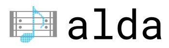

<p align="center">
  <a href="http://alda.io">
    
  </a>

  <p align="center">
    <b><a href="#installation">Installation</a></b>
    |
    <b><a href="doc/index.md">Docs</a></b>
    |
    <b><a href="CHANGELOG.md">Changelog</a></b>
    |
    <b><a href="#contributing">Contributing</a></b>

    <br>
    <br>

    <a href="https://join.slack.com/t/alda-lang/shared_invite/zt-1rq24yd5v-~gjDFzo~zuw5sei9Qj88nw">
      Join us on Slack!
    </a>
  </p>
</p>

Alda is a text-based programming language for music composition. It allows you
to compose and play back music using only your text editor and the command line.

```alda
piano:
  o3
  g8 a b > c d e f+ g | a b > c d e f+ g4
  g8 f+ e d c < b a g | f+ e d c < b a g4
  << g1/>g/>g/b/>d/g
```

> For more examples, see these [example scores](./examples/).

The language's design equally favors aesthetics, flexibility and ease of use.

(Why compose music this way instead of in a graphical sheet music notation
program? See [this blog post][alda-blog-post] for a brief history and
rationale.)

[alda-blog-post]: https://blog.djy.io/alda-a-manifesto-and-gentle-introduction/

## Features

* Easy to understand, markup-like syntax.
* Designed for musicians who don't know how to program, as well as programmers
  who don't know how to music.
* A score is a text file that can be played using the `alda` command-line tool.
* [Interactive REPL](doc/alda-repl.md) lets you enter Alda code and hear the
  results in real time.
* Supports [writing music
  programmatically](doc/writing-music-programmatically.md) (for algorithmic
  composition, live coding, etc.)
* Create MIDI music using any of the instruments in the [General MIDI Sound
  Set][gm-sound-set]

[gm-sound-set]: http://www.midi.org/techspecs/gm1sound.php

### Planned

> If you'd like to help, come on in -- [the water's fine](#contributing)!

* [Define and use waveform synthesis instruments](https://github.com/alda-lang/alda/issues/100)
* [Import MIDI files](https://github.com/alda-lang/alda-core/issues/25)
* [Export to MusicXML](https://github.com/alda-lang/alda-core/issues/3) for inter-operability with other music software
* [A more robust REPL](https://github.com/alda-lang/alda-client-java/issues/2), tailor-made for editing scores interactively

## Installation

See [the official website][alda-install] for instructions to install the latest
release of Alda.

[alda-install]: https://alda.io/install

## Demo

For an overview of available commands and options:

    alda --help

To play a file containing Alda code:

    alda play --file examples/bach_cello_suite_no_1.alda

To play arbitrary code at the command line:

    alda play --code "piano: c6 d12 e6 g12~4"

To start an interactive [Alda REPL](doc/alda-repl.md) session:

    alda repl

## Documentation

Alda's documentation can be found [here](doc/index.md).

## Contributing

We'd love your help -- Pull Requests welcome!

For a top-level overview of things we're talking about and working on, check out
the [Alda GitHub Project board][gh-project].

For more details on how you can contribute to Alda, see [CONTRIBUTING.md](CONTRIBUTING.md).

> Another way you can contribute is by [sponsoring Dave][gh-sponsor] in the
> future development of Alda.

[gh-org]: https://github.com/alda-lang
[gh-project]: https://github.com/orgs/alda-lang/projects/1
[gh-sponsor]: https://github.com/sponsors/daveyarwood

## Support, Discussion, Camaraderie

**Slack**: Joining the [Alda Slack group](https://slack.alda.io) is quick and
painless. Come say hi!

**Reddit**: Subscribe to the [/r/alda](https://www.reddit.com/r/alda/)
subreddit, where you can discuss all things Alda and share your Alda scores!

## License

Copyright © 2012-2023 Dave Yarwood et al

Distributed under the Eclipse Public License version 2.0.
