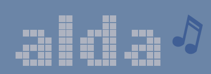
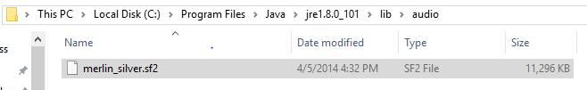

<p align="center">
  <a href="http://alda.io">
    
  </a>

  <h2 align=center>a music programming language for musicians</h2>

  <p align="center">
  <b><a href="#installation">Installation</a></b>
  |
  <b><a href="doc/index.md">Docs</a></b>
  |
  <b><a href="CHANGELOG.md">Changelog</a></b>
  |
  <b><a href="#contributing">Contributing</a></b>

  <br>
  <br>

  <a href="http://slack.alda.io">
  
  </a>
  <i>composers chatting</i>
  </p>
</p>

*New to Alda? You may be interested in reading [this blog post][alda-blog-post] as an introduction.*

Inspired by other music/audio programming languages such as [PPMCK][ppmck],
[LilyPond][lilypond] and [ChucK][chuck], Alda aims to be a powerful and flexible
programming language for the musician who wants to easily compose and generate
music on the fly, using only a text editor.  Alda is designed in a way that
equally favors aesthetics, flexibility and ease of use, with (eventual) support
for the text-based creation of all manner of music: classical, popular,
  chiptune, electroacoustic, and more!

[alda-blog-post]: https://blog.djy.io/alda-a-manifesto-and-gentle-introduction/
[ppmck]: http://ppmck.wikidot.com/what-is-ppmck
[lilypond]: http://www.lilypond.org
[chuck]: http://chuck.cs.princeton.edu

## Features

* Easy to understand, markup-like syntax
* Designed for musicians who don't know how to program, and programmers who
  don't know how to music
* A score is a text file that can be played using the `alda` command-line tool
* [Interactive REPL](doc/alda-repl.md) lets you enter Alda code and hear the
  results in real time
* Supports [writing music
  programmatically](doc/writing-music-programmatically.md) (for algorithmic
  composition, live coding, etc.)
* Create MIDI music using any of the instruments in the [General MIDI Sound
  Set][gm-sound-set]

[gm-sound-set]: http://www.midi.org/techspecs/gm1sound.php

### TODO

* [Define and use waveform synthesis instruments](https://github.com/alda-lang/alda/issues/100)
* [Import MIDI files](https://github.com/alda-lang/alda-core/issues/25)
* [Export to MusicXML](https://github.com/alda-lang/alda-core/issues/3) for inter-operability with other music software
* [A more robust REPL](https://github.com/alda-lang/alda-client-java/issues/2), tailor-made for editing scores interactively

If you're a developer and you'd like to help, come on in -- [the water's fine](#contributing)!

## Syntax example

    piano: o3
    g8 a b > c d e f+ g | a b > c d e f+ g4
    g8 f+ e d c < b a g | f+ e d c < b a g4
    << g1/>g/>g/b/>d/g

For more examples, see these [example scores](https://github.com/alda-lang/alda-core/tree/master/examples).

## Installation

> You must have [Java](https://www.java.com/en/download) 8+ installed on your system in order to run Alda.
>
> (Chances are, you already have a recent enough version of Java installed.)

### Mac OS X / Linux

* Go to the [latest release](https://github.com/alda-lang/alda/releases/latest) page and download `alda`.

* Make the file executable:

        chmod +x alda

* Make `alda` available on your `$PATH`:

  > Using `/usr/local/bin` here as an example;
  > you can use any directory on your `$PATH`.

      mv alda /usr/local/bin

### Windows

* Go to the [latest release](https://github.com/alda-lang/alda/releases/latest) page and download `alda.exe`.

* Make the file executable:
  * Go to your downloads folder, right click `alda.exe` to open up its file properties, and click `unblock`

* Copy `alda.exe` to a location that makes sense for you. If you follow standard Windows conventions, this means creating a folder called `Alda` in your `Program Files (x86)` folder, and then moving the `alda.exe` file into it.

* Make `alda` available on your `PATH`:
  *  Go to the Windows `System` Control Panel option, select `Advanced System Settings` and then click on `Environment Variables`, then edit the `PATH` variable (either specifically for your user account or for the system in general) and add `;C:\Program Files (x86)\Alda` to the end. Save this edit. Note that if you placed `alda.exe` in a different folder, you will need to use that folder's full path name in your edit, instead.

You will now be able to run Alda from anywhere in the command prompt by typing `alda`, but note that command prompts that were already open will need to be restarted before they will pick up on the new PATH value.

### Updating Alda

Once you have Alda installed, you can update to the latest version at any time by running:

```
alda update
```

### MIDI soundfonts

Default JVM soundfonts usually are of low quality. We recommend installing a good freeware soundfont like FluidR3 to make your MIDI instruments sound a lot nicer.

#### Mac OS X / Linux

For your convenience, there is a script in this repo that will install the FluidR3 soundfont for Mac and Linux users.

To install FluidR3 on your Mac or Linux system, clone this repo and run:

    scripts/install-fluidr3

This will download FluidR3 and replace `~/.gervill/soundbank-emg.sf2` (your JVM's default soundfont) with it.

#### Windows



To replace the default soundfont on a Windows OS:

1. Locate your Java Runtime (JRE) folder and navigate into the `lib` folder. 
   * If you have JDK 8 or earlier installed, locate your JDK folder instead and navigate into the `jre\lib` folder. 
2. Make a new folder named `audio`.
3. Copy any `.sf2` file into this folder.

A variety of popular freeware soundfonts, including FluidR3, are available for download [here](https://musescore.org/en/handbook/soundfonts#list).

### Editor Plugins

For the best experience when editing Alda score files, install the Alda file-type plugin for your editor of choice.

> Don't see a plugin for your favorite editor? Write your own and open a pull request to add it here! :)

- [Sublime Text](https://github.com/archimedespi/sublime-alda)
- [Atom](https://github.com/MadcapJake/language-alda)
- [Eclipse](https://github.com/VishwaasHegde/Alda-Eclipse-Plugin)
- [Vim](https://github.com/daveyarwood/vim-alda)
- [Emacs](https://github.com/jgkamat/alda-mode)

## Demo

First start the Alda server (this may take a minute):

    alda up

To play a file containing Alda code:

    alda play --file examples/bach_cello_suite_no_1.alda

To play arbitrary code at the command line:

    alda play --code "piano: c6 d12 e6 g12~4"

To start an [Alda REPL](doc/alda-repl.md):

    alda repl

## Documentation

Alda's documentation can be found [here](doc/index.md).

## Contributing

We'd love your help -- Pull Requests welcome!

The Alda project is composed of a number of subprojects, each of which has its
own GitHub repository within the [alda-lang][gh-org] organization.

For a top-level overview of things we're talking about and working on across all
of the subprojects, check out the [Alda GitHub Project board][gh-project].

[gh-org]: https://github.com/alda-lang
[gh-project]: https://github.com/orgs/alda-lang/projects/1

For more details on how you can contribute to Alda, see [CONTRIBUTING.md](CONTRIBUTING.md).

## Support, Discussion, Comaraderie

**Slack**: Joining the [Alda Slack group](http://slack.alda.io) is quick and painless. Come say hi!

**Reddit**: Subscribe to the [/r/alda](https://www.reddit.com/r/alda/) subreddit, where you can discuss all things Alda and share your Alda scores!

## License

Copyright © 2012-2019 Dave Yarwood et al

Distributed under the Eclipse Public License version 1.0.
