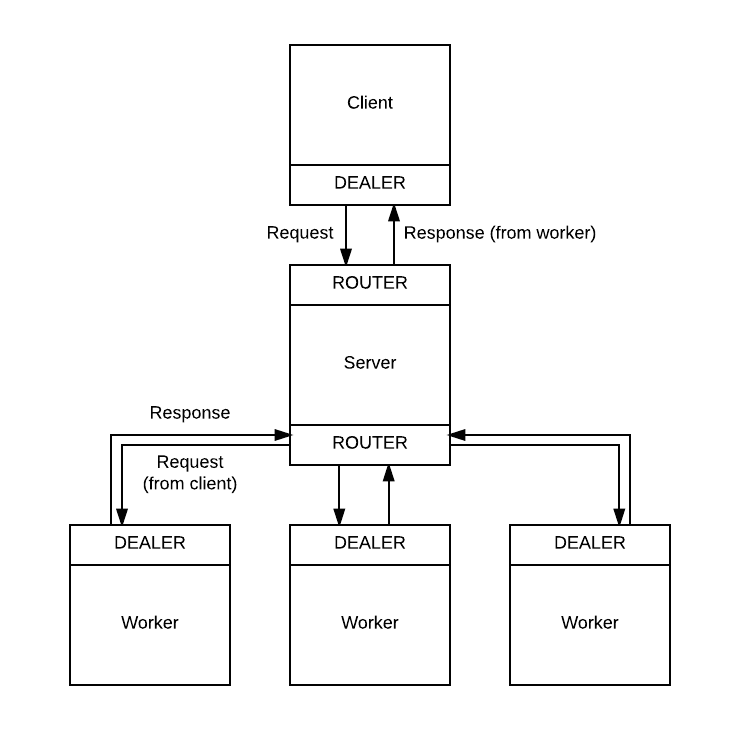

# ZeroMQ Architecture

[ZeroMQ](http://zeromq.org) plays an important role in the way Alda works. Alda consists of several programs working together: the [client](alda-client.md), [server](alda-server.md), and [worker](alda-worker.md) processes. As a framework for inter-process communication, ZeroMQ is the glue that holds it all together.

If you are new to ZeroMQ, the [ZeroMQ Guide](http://zguide.zeromq.org/page:all) is an excellent resource for learning about ZeroMQ and inter-process communication in general.

## Version Information

The official Alda client, server, and workers use [JeroMQ](https://github.com/zeromq/jeromq), a pure Java implementation of libzmq that is compatible with (non-Java, native) ZeroMQ. If you are writing your own Alda client, server, or worker, you do not need to use JeroMQ in order to communicate with the existing implementations of these components. As long as you are using a compatible version of libzmq, your implementation should be compatible.

We are using JeroMQ 0.3.5, which is based on libzmq 3.2.5 (version string "3.2.5", version int 30205). The transport protocol is ZMTP/2.0.

## Overview

Below is a diagram showing the connections between an Alda client, server, and workers.



There are two types of socket transactions here:

* DEALER/ROUTER between client and server
* DEALER/ROUTER between worker and server

This is very close to the [Paranoid Pirate Pattern](http://zguide.zeromq.org/page:all#toc91) described in the ZeroMQ guide. The only difference is that the client connects via a DEALER socket rather than a REQ socket. The reason for this is that the DEALER socket offers more flexibility in terms of the message structure.

## Message Structure

### Client

#### Outbound

An Alda client will only send one type of message -- a three-frame message that consists of:

  1. The return address of the client. This is usually added by default by ZeroMQ.

    This frame serves as a "return envelope" to ensure that the response from the worker goes back to the right client.
  2. A string of JSON representing the request, which will be read and handled by the worker. For example, a request to play a string of code might look like this:

    ```json
    {"command": "play", "body": "piano: c8 d e f g2"}
    ```

    Depending on the command, the request JSON may also contain a map of `"options"`.

    _(TODO: definitive list of commands and options)_

  3. A simple string representing the command. For example, `play`. The server examines this frame in order to quickly determine if a message is something it can handle itself or if it needs to forward the request to a worker.

#### Inbound

After sending a request, the client can receive a string of JSON in response. Here is an example response, after sending a request to play a string of Alda code:

```json
{"success": true, "body": "Playing..."}
```

A server response will always include a `"success"` field which will be a boolean indicating whether or not the operation was successful, and a `"body"` field providing additional context.

### Server

#### Inbound - Frontend Socket

See "Client - Outbound" above.

Messages from the client contain 3 frames. The server inspects the last frame to determine which command is being requested and decide whether the server can handle the request itself or whether it needs to forward the request to a worker.

#### Inbound - Backend Socket

A message from a worker may contain 1 frame or 3 frames.

If it contains 1 frame, it is a heartbeat signal from the worker. See below for more information about heartbeats.

If it contains 3 frames, it is a response to the client and should be forwarded along the frontend socket.

#### Outbound - Frontend Socket

A server may send two types of messages on the frontend socket:

* Forwarded worker responses.

* A direct response to a command the server can handle, e.g. `version`.

  Responses need to be a JSON string that can be understood by the client; see "Client - Inbound" above.

#### Outbound - Backend Socket

A server may send two types of messages on the backend socket:

* Forwarded client requests.

* A single-frame signal such as `KILL` or `HEARTBEAT`.

### Worker

#### Inbound

Workers can receive two types of messages from the server:

* Forwarded client requests. The second frame is a JSON string representing the request. See "Client - Outbound" above.

* A single-frame signal from the server.

#### Outbound

A worker may send two types of messages to the server:

* A three-frame response to a client request. See "Client - Inbound" above.

* A single-frame signal such as `READY`, `BUSY` or `AVAILABLE`.

## Responsibilities

This section describes the technical requirements of each role in the Alda architecture. This may be useful if you are interested in writing your own Alda client, server, or worker implementation.

### Client

* Send requests to the server via a DEALER socket. The requests must match the message structure described above.

  * A good practice is to implement request retries, for better client-side reliability. For further reading on this, see the [Lazy Pirate Pattern](http://zguide.zeromq.org/page:all#Client-Side-Reliability-Lazy-Pirate-Pattern) section of the ZeroMQ guide.

* Receive responses from the server via the same socket and deserialize the body of the response (a JSON string).

* Utilize the `"success"` field in responses to determine if the operation was a success. In either case, the `"body"` field will provide additional context, e.g. an error message if there was an error.

### Server

* (optional) Manage the worker processes. This may include:
  * Starting the desired number of workers upon server startup.
  * Regularly checking up on the number of workers currently available, and starting more (or killing off excess workers) as needed.

  This can be somewhat complex. The good news is that the ZeroMQ guide does a great job of explaining how to do this via heartbeating.

  The current Clojure implementation of the server and workers involves sending single-frame heartbeat messages back and forth between the server and workers, so that each side is aware of whether or not the other side is alive. See below for information about the heartbeat messages sent by the workers. The overall idea is that the server uses the worker heartbeats to maintain its own queue of available workers and take note of which ones are busy.

* Bind two ROUTER sockets for the "frontend" (client) and "backend" (workers).

* Run in a single-threaded loop. On each iteration of the loop, do the following:

  * Check the backend socket for messages from workers. Inspect the size of the message (the number of frames).
    * If it is a 3-frame message, it is a response to the client. Send it along on the frontend socket.
    * If it is a 1-frame message, it is a "heartbeat" from the worker telling you that it is either:
      * `READY` (worker just spawned and is telling you it's ready)
      * `AVAILABLE` (worker is ready to take a request)
      * `BUSY` (worker is alive, but busy playing a score)

      It is up to you to decide how to interpret these messages. For a bare minimum server implementation, the simplest thing you can do is ignore them; the message routing system will still work, but workers will be chosen "round-robin," and the server will have no knowledge about which workers are busy.

      For further reading on load balancing and heartbeats, as well as code examples, see [Heartbeating](http://zguide.zeromq.org/page:all#Heartbeating) in the ZeroMQ guide.

  * Check the frontend socket for messages from clients.
    * Inspect the last frame of the message, which contains just the command.
      * If it is a command that can be handled without a worker (e.g. `status`), handle it and send a response directly to the client.
      * If it is a command that needs to be handled by a worker, send the message along on the backend socket.

  * Send a single-frame `HEARTBEAT` message to all available workers.

### Worker

* Implement, or leverage an existing implementation of, the Alda core library and sound engine.

  In other words, be able to parse, evaluate, and play strings of Alda code.

* Connect to the server backend port via a DEALER socket.

* (optional) Send a one-frame `READY` message once ready to receive messages.

* Run in a single-threaded loop. On each iteration of the loop, do the following:
  * Check for messages from the server. Inspect the size of the message (the number of frames).
    * If it is a 3-frame message, it is a request from the client. Handle it and send a response back.
    * If it is a 1-frame message, it is a signal from the server, which can be:
      * `KILL` (an instruction to shut down)
      * `HEARTBEAT` (a heartbeat indicating the server is still alive)

      See above for more details about heartbeats. On the worker side, the idea is that the worker can detect when a server stops sending heartbeats and conclude that the server is down, and then the worker can shut down itself. This helps to prevent stray / "orphaned" worker processes that could linger around forever if, for example, the server crashed without telling its workers to shut down first.

      As with the server implementation, sending and receiving heartbeats is strictly optional, but it enables the server to reliably manage a pool of available workers. It also enables the worker to detect when the server is down and act accordingly.

  * (optional) Send the server a heartbeat. This is a single-frame message that says either `BUSY` or `AVAILABLE`.

